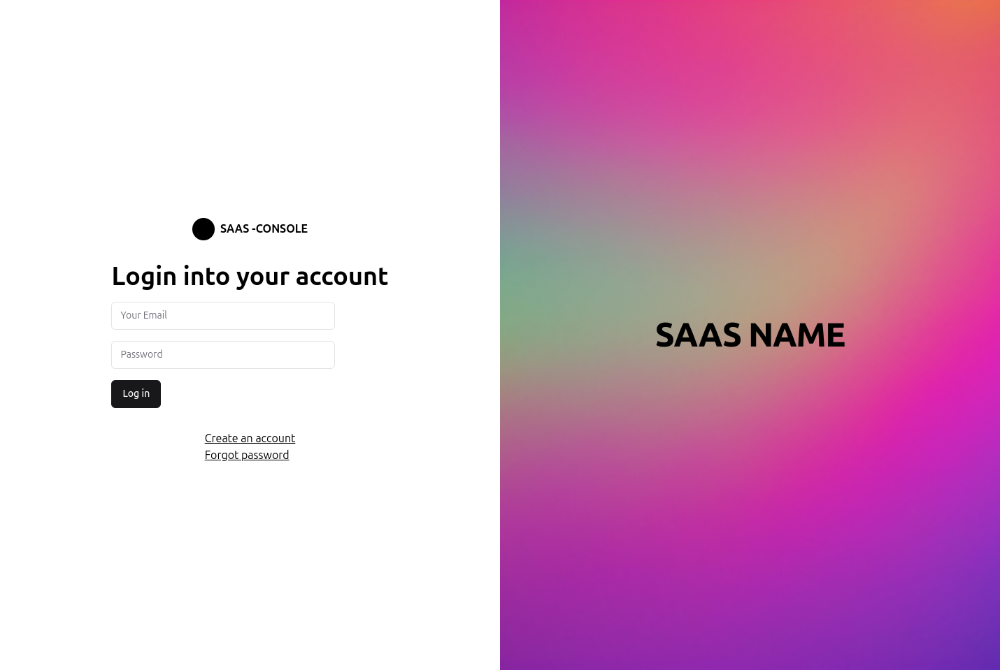
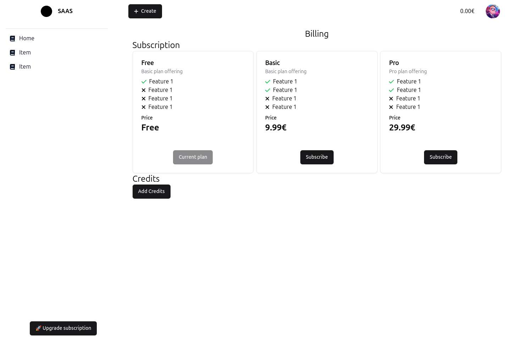

# ANOTHER SAAS

Saas with the following stack:
- SvelteKit
- Shadcn
- PocketBase
- Temporal

## Features
- Email Login
- Mail verification
- Password Reset
- Subscription Management
- Temporal connected to PocketBase and watching for changes


## Roadmap
- [ ] 📨 Receive email for subscription/payment/unsubscription
- [ ] 🔒 Add security rules to PocketBase
- [ ] 🌐 Internationalization
- [ ] 🔑 Reset password
- [ ] 👤 Upload user profile picture
- [ ] 🧼 Refactor: Types 


## Screenshots





## Quick start

copy `.env.example` to `.env` and fill the required fields

Launch the stack with `docker-compose up`

Landing page is available at http://localhost:2002
Frontend is available at http://localhost:2001
Backend is available at http://localhost:2002
Temporal UI is available at http://localhost:2003

**Start temporal schdules**

```bash
```


## Pocketbase configuration

### Update app url
In http://localhost:8090/_/?#/settings, update the app url to the frontend url

### Email verification
In email verification template, under the action field, add the following line:

`{APP_URL}/account/verify?token={TOKEN}`
⚠️ Be sur to set the correct APP_URL in the Application tab